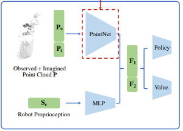
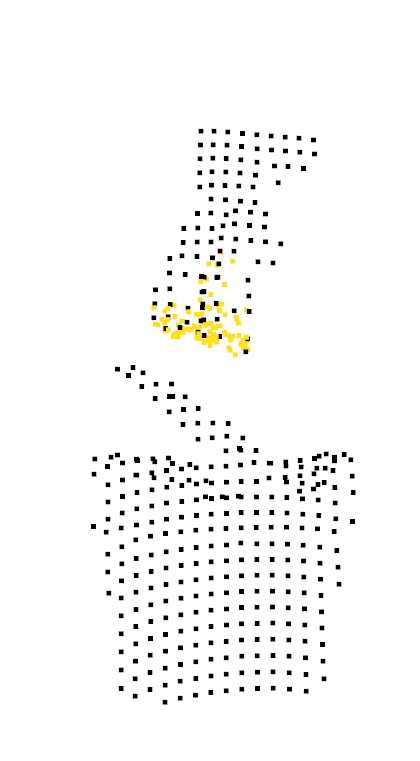
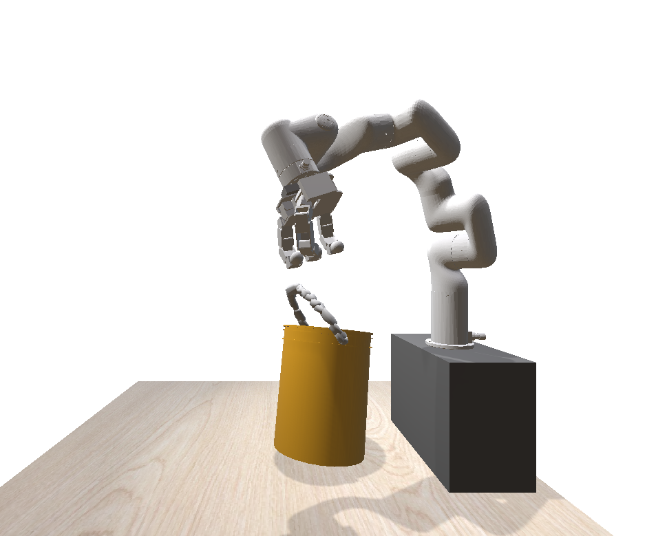
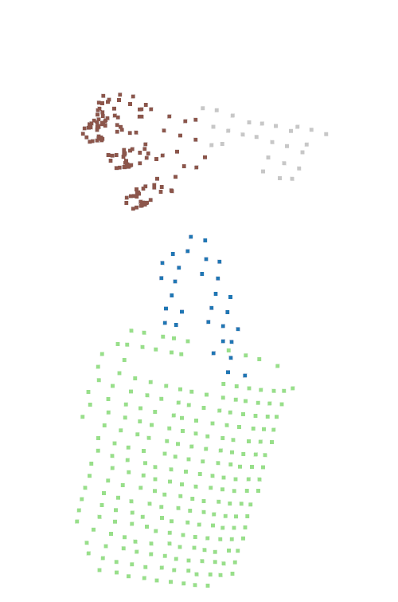

# &#x1F916; MLR project
Влияние архитектуры энкодера облаков точек на качество обучения RL-моделей в задачах манипуляции.


# &#x1F4D8; Содержание
- [&#x1F3AF; Идея проекта](#-идея-проекта)
- [&#x2699; Установка](#-установка)
- [&#x1F30D; Примеры использования скриптов](#-запуск)
- [&#x1F30D; Описание окружения](#-описание-окружения)
- [&#x1F9E0; Описание решения](#-описание-решения)
- [&#x1F4C8; Результаты](#-результаты)

--- 


# &#x1F3AF; Идея проекта
## Тема
Влияние архитектуры энкодера облаков точек на качество обучения RL-моделей в задачах манипуляции.

## Краткое описание

Современные методы роботизированной манипуляции всё чаще используют облака точек в сочетании с подходами обучения с подкреплением (RL). Эффективность таких систем во многом определяется качеством энкодера, преобразующего необработанное облако точек в информативное  представление. В модульной архитектуре DexPoint влияние выбора типа энкодера на точность, устойчивость и способность модели к обобщению остаётся недостаточно изученным. Проект направлен на сравнительный анализ различных архитектур энкодеров и оценку их влияния на процесс обучения и итоговое качество RL-модели.

## Направление исследования:

Планируется обучить несколько вариантов DexPoint, различающихся только архитектурой энкодера облаков точек, и провести их систематическое сравнение. Исследовать:
— какие архитектурные особенности (локальные фичи, глубина сети) оказывают наибольшее влияние;
— как различия в энкодерах отражаются на скорости обучения и вычислительной эффективности;
— как предварительное обучение энкодера влияет на финальное качество RL-модели.

--- 
# &#x2699; Установка
## Клонирование репозитория
1. Склонировать репозиторйи

    ```bash
    git clone https://github.com/StoryTeller72/MLR_project.git
    cd project
    conda create --name project python=3.8
    conda activate project
    pip install -e .    
    conda install pytorch==1.12.1 torchvision==0.13.1 torchaudio==0.12.1 -c pytorch    
    ```
2. Скачать папки с [ассетами](https://drive.google.com/file/d/1XY_aTbPkKZvH_gb21j5VePdANF2p81W4/view?usp=sharing)  и [артифактами](https://drive.google.com/file/d/1-FnwCIY9h24raHwEz3Ai1cYUqi_InQCa/view?usp=sharing) 
## Структура файлов
```
└── 📁ProjectMy
    └── 📁dexart
        └── 📁env: окружение 
    └── 📁 assets: описание задачи, объекты сцены, URDF робота
    └── 📁 artifacts: RL checkpoints
    └── 📁EncoderModels: описание моделей енкодеров       
    └── 📁scripts: скрипты для обучения и визуализации результатов
        └── 📁examples
        └── 📁generateDataSet: генерация датасета для классификации и сегментации
        └── 📁mainPolicyScripts: скрипты для обучения всего пайплайна
        └── 📁PointEncoderScripts: скрипты для предобучения енкодеров
    └── 📁stable_baselines3: модифицированный код для описания всего пайплайна 
```

# &#x2699; Запуск
## Пример визуализации облака точек
```
    python scripts/examples/visualize_observation.py --task_name=bucket
```

## Пример обучения енкодера PointNet
```
    python scripts/PointEncoderScripts/PointNet/trainPointNetClass.py
```

## Пример генерации датасета для сегментации
```
    python scripts/generateDataSet/getRandomDataSeg.py
```

## Пример обучения  агента
```
    python scripts/mainPolicyScripts/FullPolicyTrain.py --n 100 --workers 10 --iter 400 --lr 0.0001 &&
--seed 100 --bs 500 --task_name bucket --extractor_name smallpn &&
--pretrain_path <путь до предобученной модели> 
```


# &#x1F9E0; Описание решения

## Архитектура DexPoint
[DexPoint](https://arxiv.org/abs/2211.09423)  — это обучаемая архитектура управления, предназначенная для реализации обобщаемых навыков манипуляции с использованием облаков точек и роботизированной руки с высокой степенью свободы. Ключевая особенность DexPoint — возможность успешного переноса из симуляции в реальный мир  c минимальным дообучением на реальных данных.

Система основана на использовании данных с сенсора облаков точек и проприоцептивной информации. DexPoint демонстрирует высокую способность к обобщению, работая с ранее не встречавшимися объектами и сценами.

DexPoint строится на трёх ключевых принципах:
- Использование облаков точек в качестве основного представления объектов и сцены;
- Вычисление воображаемого облака точки руки для компенсации неполноты наблюдений;
- Применение методов RL с модифицированной функцией наград, основанной на контактах, но без необходимости тактильных сенсоров.


Архитектура состоит из следующих компонентов:
- **PointNet-экстрактор признаков** обрабатывает объединённые облака точек (наблюдаемые и синтезированные для пальцев).
- **MLP-модуль** (многослойная нейронная сеть) для оценки положения робота.
- **Конкатенация признаков** визуальных и проприоцептивных наблюдений.
- **Сети Actor и Critic** (многослойные нейронные сети), RL алгоритм, предсказывают действия для робота.




В задаче точного захвата важную роль играет информация о положении
кисти и пальцев, поэтому низкое разрешение облака точек во время обучения
RL, где есть ограниченние на количество точек из-за ограничения памяти,
может быть критичным. А так же во время манипуляции части кисти часто перекрывают друг друга от камеры.  В этом случае количество точек пальцев руки может быть недостаточным для понимания пространственного отношения между роботом и объектом. Поэтому предлагается дополнительно достраивать
”вооброжаемые”облака точек, которые позволят получать точное положение
руки. Для вычисления таких точек используется решение прямой задачи киниматки для пальцев, после этого синтезируются дополнительные точки  (”вооброжаемые" точки выделены красным цветом).




## Функция награды


DexPoint использует сложную функцию награды, включающую:

$$ R=w_{reach}r_{reach} + w_{contact}r_{contact} + w_{progress}r_{progress} + w_{penalty}r_{penalty}$$


Где $r_{reach}$ отвечает за награду на первой фазе взаимодействия робота и объекта, то есть награждает агента за приближение кисти к объекту.
$$r_{\text{reach}} =  \min \Big(-\lVert \mathbf{x}_{\text{palm}} - \mathbf{x}_{\text{object}} \rVert, \lambda \Big)$$
$\mathbf{x}_{\text{palm}}, \mathbf{x}_{\text{object}}$ — трёхмерные координаты ладони и объекта в мировой системе координат, а λ — параметр регуляризации, предотвращающий резкий рост значения вознаграждения.
Важно учитывать, что если кисть находиться очень близко или даже столкнулась с объектом не всегда можно произвести захват. Например, кисть могла коснуться объекта тыльной стороной, в таком случае захват невозможен. Эмпирически удалось выяснить, что если большой палец и хотя бы два пальца касаются объекта, то объект находиться между пальцам и можно произвести захват. За проверку этого условия отвечает слагаемое  $r_{contact}$:
$$r_{contact} = \boldsymbol{Contact}(thumb,object) \land \newline(\sum_{fingers}\boldsymbol{Contact}(finger,obgect) \geq 2)$$

За поведение после захвата отвечает слагаемое $r_{progress}$:
$$r_{progress}=r_{contact}\boldsymbol{Progress}(x_{obj}, x_{target})$$
Слагаемое $Progress$ подбирается исходя из задачи.


# &#x1F30D; Описание окружения
Окружение состоит из манипулятора xarm6 в качестве ендэффектора используется alegroHand.

Агенты обучались на задачу манипуляции ведром, а именно роботу нужно взять ведро и поднять его на определенную высоту.



Так же для предобучения енкодеров на основе окружения были собраны датасеты для сегментации и классификации по облакам точек.



# &#x1F4C8; Результаты

| Model | PointNet | PointNet++|
| ---   | ---      | ---       |
| success rate| 0.45   |  0.18         |
|mean reward|   528   |     168      |
